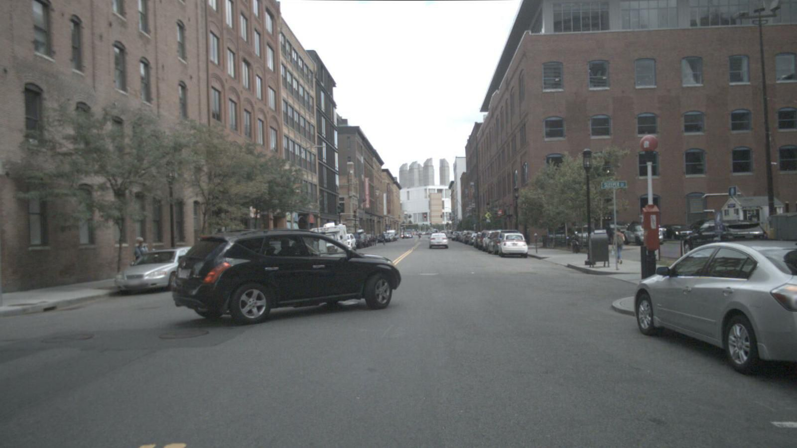
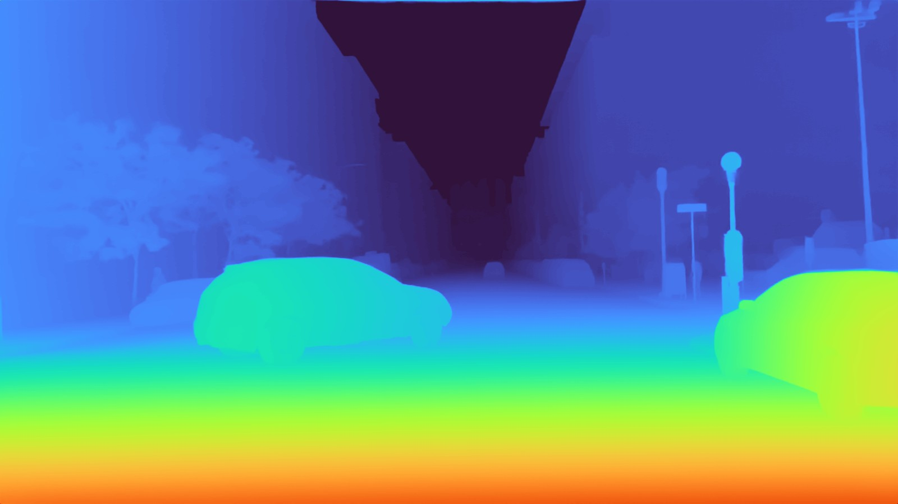
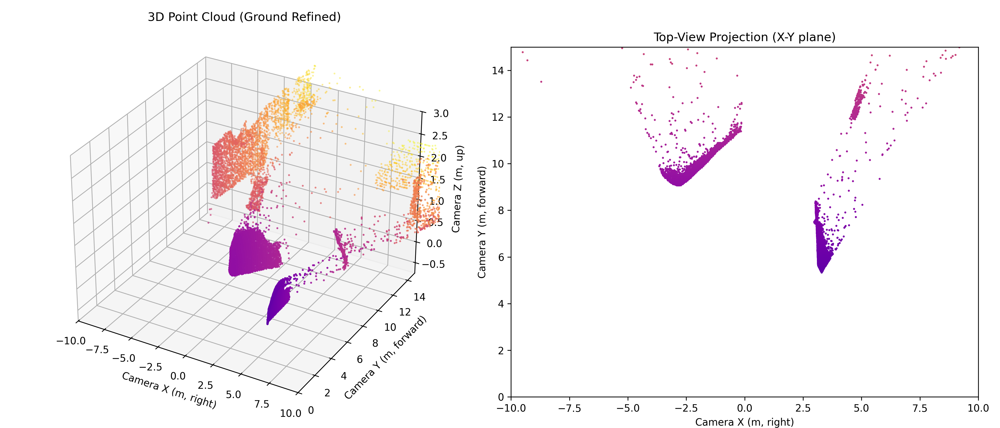
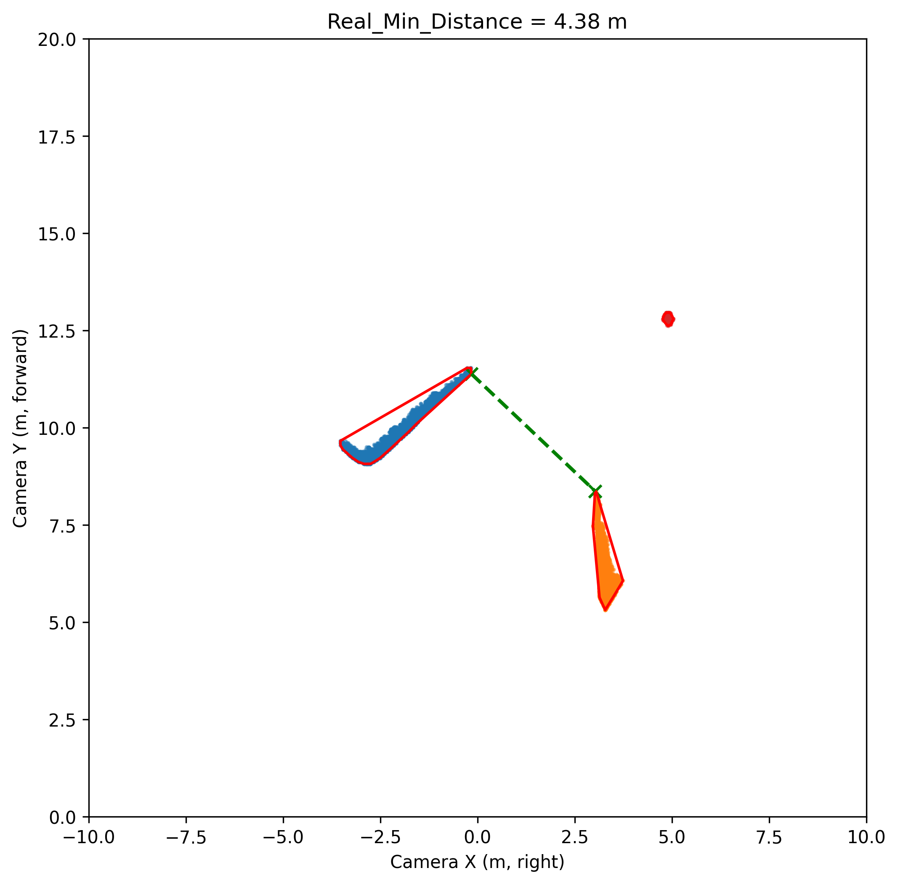
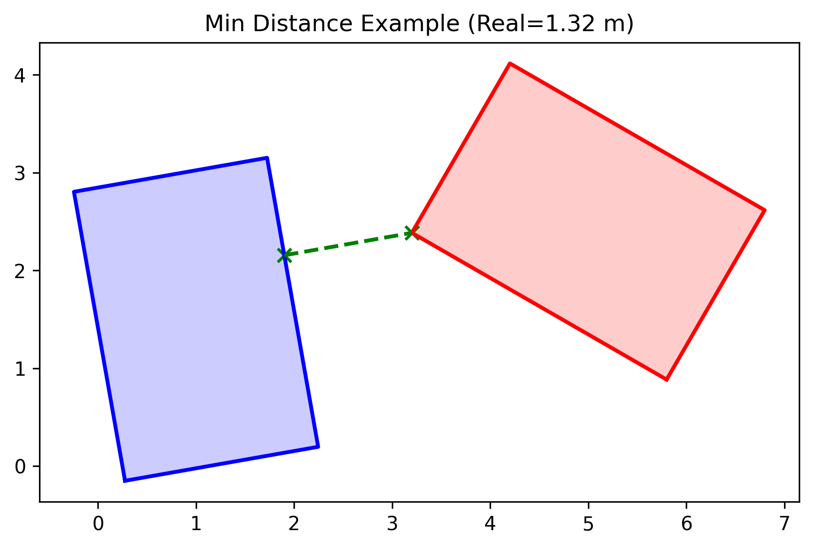

# DepthPro 기반 Ambiguous Clearance Detection ADAS  ( 2025.09 ~ ing )
(DepthPro-based Ambiguous Clearance Detection ADAS)


<p align="center">
  
</p>


## 🧩 개요 (Overview)

이 프로젝트는 **Apple의 DepthPro 단안(Monocular) 깊이 추정 모델**을 기반으로,
차량 주변의 **모호한 여유 거리(Ambiguous Clearance)** 상황을 정량적으로 인식하고
**DBSCAN + Alpha Shape + Shapely Distance**를 통해
객체 간의 **실제 최소 거리(Metric Minimum Distance)** 를 계산 및 시각화하는
**ADAS(Advanced Driver Assistance System)** 알고리즘 구현입니다.

This project implements an **Ambiguous Clearance Detection ADAS algorithm**
based on Apple’s **DepthPro monocular metric depth model**.
It detects ambiguous clearance regions by combining
**DBSCAN clustering, Alpha Shape contour extraction, and Shapely-based distance computation.**

---

## 🤓 개발 및 실행 환경 (Development Environment)

이 코드는 **Conda 가상환경**에서 실행하도록 구성되어 있습니다.
처음 사용하는 사용자는 아래 순서대로 따라 하면 됩니다.


### 0️⃣ 프로젝트 복제 (Clone Repository)

```bash
git clone https://github.com/kangminyeong-dev/DepthPro-Ambiguous-Clearance-ADAS.git
cd DepthPro-Ambiguous-Clearance-ADAS
```


### 1️⃣ Conda 환경 생성 (Create Conda Environment)

```bash
conda env create -f environment.yml
conda activate depth-pro
```


### 2️⃣ DepthPro 모델 가중치 다운로드 (Download DepthPro Weights)

```bash
bash get_pretrained_models.sh
```

→ 실행 시 `checkpoints/` 디렉터리 내부에 모델 가중치가 자동 저장됩니다.
(본 프로젝트에서는 원본 **Apple DepthPro**의 사전학습 가중치를 그대로 사용합니다.)


### 3️⃣ 코드 실행 위치 (Execution Path)

모든 실행은 깃클론한 폴더 내부(`ml-depth-pro`)를 기준으로 수행됩니다.
예를 들어:

```bash
python kmy-depthpro-dev/01_depthpro_visualization.py
```

---

## ⚙️ 프로젝트 구조 (Project Structure)

```
ml-depth-pro/
 ├── kmy-depthpro-dev/        ← 주요 개발 코드 (01~20 단계)
 │    ├─ 01_depthpro_visualization.py
 │    ├─ 02_nuscenes_intrinsic_projection.py
 │    ├─ 03_gpu_inference_projection.py
 │    ├─ ...
 │    └─ 20_point_optimize_realtime.py
 │
 ├─ result/                   ← 결과 이미지/데이터 저장 폴더
 ├─ data/                     ← 입력 예시 이미지
 ├─ environment.yml           ← Conda 환경 설정 파일
 ├─ get_pretrained_models.sh  ← DepthPro 가중치 다운로드 스크립트
 ├─ README.md
 └─ LICENSE
```

각 `.py` 파일은 독립적으로 실행 가능하며,
01 → 20 순서로 단계별로 Depth 기반 ADAS 기능이 확장되도록 설계되어있습니다.

Each Python file can be executed independently.
The development sequence (01 → 20) follows the incremental building process of the ADAS pipeline.

## 🧾 실행 예시 (Example Usage)

```bash
python kmy-depthpro-dev/09_integrated_min_distance_pipeline.py
```
각각 실행하면 01~20 단계까지 모든 결과를 직접적으로 볼 수 있습니다.


## 📊 시각화 결과 (Visualization Results)

<p align="center">
   
  
</p>
<p align="center">
  
</p>
<p align="center">
   
  
</p>

---

## 🧩 핵심 기술 구성 (Core Components)

| 구성 요소               | 설명 (KOR)       | Description (ENG)                        |
| ------------------- | -------------- | ---------------------------------------- |
| DepthPro            | 단안 기반 깊이 예측 모델 | Monocular metric depth estimation        |
| DBSCAN              | 포인트 클러스터링      | Density-based clustering                 |
| Alpha Shape         | 외각 다각형 추출 알고리즘 | Boundary extraction for clustered points |
| Shapely             | 다각형 간 최소 거리 계산 | Geometric distance computation           |
| Matplotlib / OpenCV | 시각화 도구         | Visualization and rendering              |


## 📚 참고 논문 (Citation)

DepthPro 모델의 사전학습 가중치를 사용하는 경우, 아래 논문을 인용하십시오.  
If you use the pretrained DepthPro weights in your research, please cite the following paper:

Aleksei Bochkovskii et al.,  
*Depth Pro: Sharp Monocular Metric Depth in Less Than a Second*,  
ICLR 2025.  
[https://arxiv.org/abs/2410.02073](https://arxiv.org/abs/2410.02073)


## 🔗 원본 레포지토리 (Original Repository)

이 프로젝트는 Apple의 **DepthPro** 공식 오픈소스 코드를 기반으로 확장되었습니다.  
The base implementation is derived from Apple’s official **DepthPro** repository:

🔗 https://github.com/apple/ml-depth-pro  
© Apple, released under the Apple Sample Code License.


## 🪪 라이선스 (License)

이 저장소의 코드는 Apple의 DepthPro 원본 라이선스 조건을 따르며,  
추가 구현된 ADAS 알고리즘은 **연구 및 비상업적 용도**에 한정됩니다.  

The original DepthPro license applies to the pretrained model weights.  
All additional ADAS algorithm implementations in this repository are released  
for **research and non-commercial use only**.


---

## 👤 프로젝트 작성자 (Author)

**Kang MinYeong (강민영)**  
Undergraduate Student at Ajou University  
project on AI-based Autonomous Driving and ADAS perception  
📍 Suwon, South Korea


