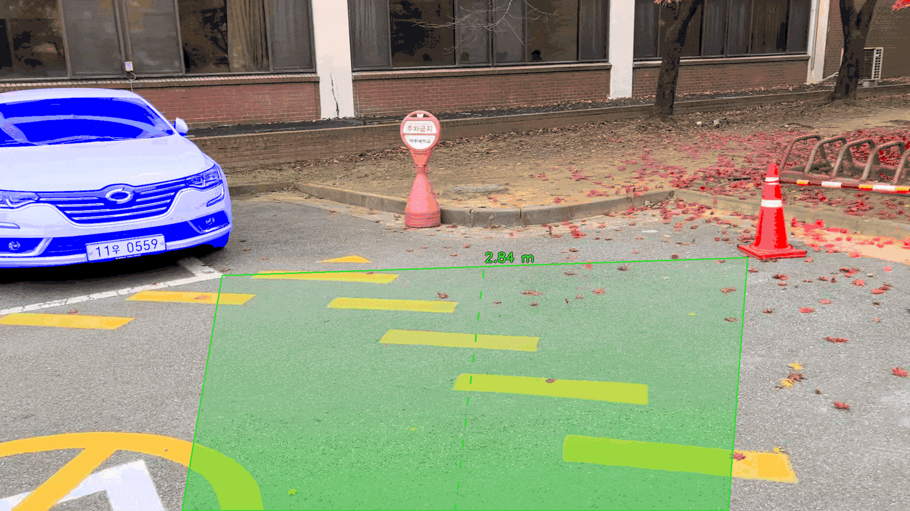

# Ambiguous Clearance Detection ADAS V2 (2025.09 ~ ing)
(DepthPro-based Ambiguous Clearance Detection ADAS V2)

<p align="center">
  
</p>

**이 시각화는 실제 시연 검증을 위해, 아주대학교 다산관–혜강관 사이 실제 주차장에서 팀원들과 직접 촬영하였습니다.**<br>
**test_frames1 / test_frames2 폴더의 모든 이미지는 팀원의 휴대폰으로 직접 수집한 데이터셋입니다.**<br><br>

**카메라 내부 파라미터(K)와 왜곡 계수(dist)는 체커보드를 이용해 직접 캘리브레이션했습니다.**<br>
**위 GIF는 실제 수집한 데이터셋을 기반으로 동작하는 V2 ADAS 파이프라인의 결과입니다.**<br><br>

**This visualization is generated from real-world data captured by our team at Ajou University.**<br>
**Camera intrinsic parameters and distortion coefficients were calibrated by ourselves using a checkerboard.**<br>


📸 Visualization Results (V2)
<p align="center">  </p>
<p align="center">  </p>
<p align="center">  </p>
<p align="center">  </p>
<p align="center">  </p>
<p align="center">  </p>
<p align="center">  </p>

---

## 🧩 개요 (Overview)

이 프로젝트는 **Apple DepthPro 단안(Monocular) metric depth 모델**과  
**Meta SAM2(Segment Anything Model 2)** 를 조합하여,
카메라 한 대만으로 주변 장면의 **절대 거리(Absolute distance)** 를 재구성하고,
지면(Ground)과 도로(Road)를 제거한 뒤,
**DBSCAN + Alpha Shape + Shapely Distance** 로 객체를 다각형 폴리곤으로 감싸고,
두 객체 사이 **실제 최소 거리(minimum clearance)** 를 계산·시각화하는  
**Ambiguous Clearance Detection ADAS V2** 파이프라인이다.

- 탑뷰(Top-view) 객체 폴리곤 시각화
- 위험 객체 쌍 자동 선택 로직
- 실제 영상 위 ROI(진입 가능/불가 구간) 그라데이션
- 중앙 점선 기반 가상 주행 경로 표시
- 좌/우 객체에 대한 SAM2 세그멘테이션 앵커 포인트
등을 포함한 **실전형 ADAS 시각화**까지 제공한다.

---

## 🔁 V1->V2 주요 변경점 (What’s new in V2)

- **Grid 기반 지면 제거(Ground Removal)**
  - X–Z 평면을 0.2m 간격 그리드로 나누어
  - cell 내부 Y 표준편차로 지면 판별 → sparse 환경에서도 안정적

- **Depth 기반 Road Seed + SAM2 Road Segmentation**
  - Z축 구간별 가장 낮은 Y 포인트 추출해 도로 후보 시드
  - SAM2의 positive point로 도로 마스크 생성
  - ground mask ∪ road mask 로 최종 제거

- **DBSCAN + Alpha Shape + Shapely distance 전면 개선**
  - 객체 클러스터 분리 후 폴리곤 생성
  - 폴리곤 간 최소 거리 및 최근접점 계산

- **Polygon Pair Filtering / 선택 로직 강화**
  - Z축과 너무 평행한 경우 제거  
  - 카메라에 더 가까운(Z 작음)·중앙(X≈0) 객체 우선  
  - 최종적으로 가장 위험한 쌍 1개 선택

- **6단계 디버깅 스크립트(debug01~06) 제공**
  - Depth → Point Cloud → Ground/Road Filtering → Polygons → Minimum Clearance → Final ADAS

- **최종 ADAS Overlay 완전 구현**
  - 상단점 기반 ROI 사다리꼴 생성  
  - Green/Red 계열 그라데이션  
  - 중앙 점선 경로  
  - SAM2 객체 세그멘테이션 추가

---

## 🚀 설치 및 세팅 (Installation & Setup)

### 0️⃣ 프로젝트 복제 (Clone Repository)
```bash
git clone https://github.com/kangminyeong-dev/DepthPro-Ambiguous-Clearance-ADAS.git
cd DepthPro-Ambiguous-Clearance-ADAS
```

### 1️⃣ Conda 환경 생성 (Create Conda Environment)
```bash
conda env create -f environment.yml
conda env list     # 생성된 환경 이름 확인
conda activate <environment-name>
```

### 2️⃣ DepthPro 가중치 다운로드 (Download DepthPro Weights)
```bash
cd ml-depth-pro
bash get_pretrained_models.sh
cd ..
```
실행 결과는 `ml-depth-pro/checkpoints/` 내부에 저장된다.

### 3️⃣ SAM2 설치 및 체크포인트 준비
```bash
cd sam2
pip install -e .
cd ..
```

SAM2 체크포인트 파일은 아래 경로를 사용한다.
```
sam2/checkpoints/sam2.1_hiera_small.pt
```

직접 다운로드 후 해당 위치에 두면 된다.

---

## 📁 프로젝트 구조 (Project Structure, V2)

```
DepthPro-Ambiguous-Clearance-ADAS/
 ├── ml-depth-pro/             
 ├── sam2/                     
 ├── test_frames1/             
 ├── test_frames2/             
 ├── checkpoints/              
 │
 ├── debug01.py 개발 및 디버깅 과정 01~06
 ├── debug02.py
 ├── debug03.py
 ├── debug04.py
 ├── debug05.py
 ├── debug06.py
 │
 ├── main.py 최종 완성 코드
 ├── environment.yml
 ├── visualization_opt.gif
 ├── image1.png ~ image7.png 디버깅 이미지
 ├── README.md
 └── .gitignore
```

---

## 🧾 실행 예시 (Example Usage)

### 단일 프레임 디버깅
```bash
python debug01.py
python debug02.py
python debug03.py
python debug04.py
python debug05.py
python debug06.py
```

### 전체 파이프라인
```bash
python main.py
```

---

## 🧩 핵심 구성 요소 (Core Components, V2)

**DepthPro**  
- Monocular metric depth estimation  
- NuScenes 기반 metric-depth 그대로 사용

**Camera Calibration**  
- 내부 행렬 K, 왜곡 계수 dist  
- `cv2.undistortPoints()`  

**Ground + Road Filtering**  
- Grid 기반 Y std filtering  
- Depth 시드 → SAM2 road mask → OR 조합  

**DBSCAN + Alpha Shape + Shapely**  
- 밀도 기반 클러스터링  
- Alpha Shape 폴리곤 생성  
- Shapely distance 로 최소 거리 계산  

**Polygon Pair Selection**  
- Z축 방향 평행 제거  
- 중앙/근거리 우선  
- 최종 위험 쌍 선택  

**Final ADAS Visualization**
- ROI 사다리꼴  
- Green/Red 그라데이션  
- 점선 경로  
- SAM2 객체 세그멘테이션  

---

## 📚 참고 및 인용 (Citation)

DepthPro:
Aleksei Bochkovskii et al.,  
*Depth Pro: Sharp Monocular Metric Depth in Less Than a Second*,  
ICLR 2025. https://arxiv.org/abs/2410.02073

SAM2:
Meta AI,  
*Segment Anything Model 2 (SAM2)*  
https://github.com/facebookresearch/sam2

---

## 🪪 라이선스 (License)

이 프로젝트는 Apple DepthPro 및 Meta SAM2 라이선스를 존중하며,  
추가 구현된 ADAS 파이프라인은 **연구 및 비상업적 용도**를 기준으로 한다.

---
